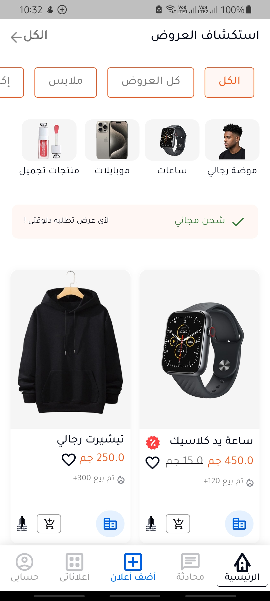
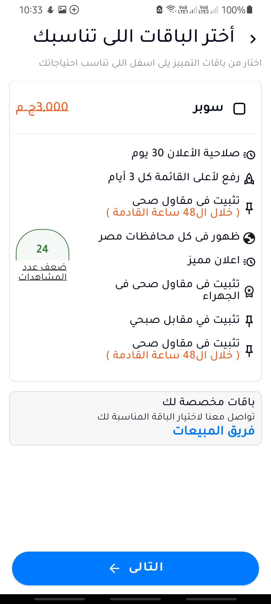
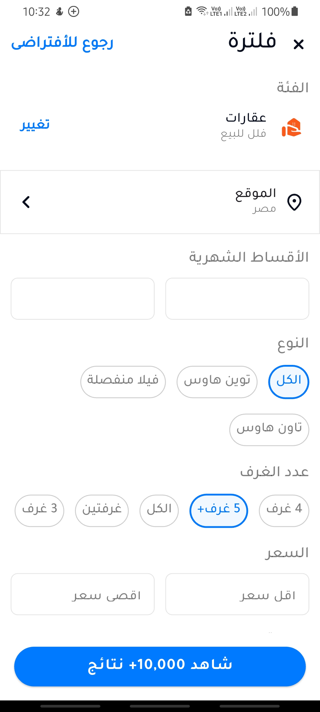

# 🧩 ahmed_mossad_flutter_task

A new Flutter project built with **Clean Architecture**, **BLoC**, and **SQLite** for local data storage.  
The project demonstrates best practices in Flutter app development — including state management, dependency injection, and modular UI design.

---

## 🚀 Features

- Responsive UI using `flutter_screenutil`
- Modern icons and illustrations using `flutter_svg`
- Local Database using `sqflite`
- Dependency Injection with `get_it` & `injectable`
- State Management using `Bloc` & `flutter_bloc`
- Navigation using `go_router`
- Auto-generated assets with `flutter_gen_runner`
- Device preview support for testing responsiveness

---

## 📱 Screenshots

  
  
  
  

